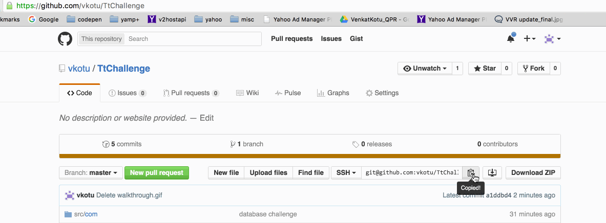

# TtChallenge
#instructions to run the program

Make sure to have Java and Git installed on your machine
please note variables are case sensitive

If input provided through command line

1. git clone git@github.com:vkotu/TtChallenge.git
2. cd TtChallenge
3. cd src
4. javac com/tt/challenge/Main.java
5. java com.tt.challenge.Main

#You will see the prompts to  "Enter a Command:"
You can start testing by issuing commmands, program exits as soon as you enter "END"

If providing file as input
follow Steps 1 to 4 
5. java com.tt.challenge.Main inputfilepath

Walkthrough: 

